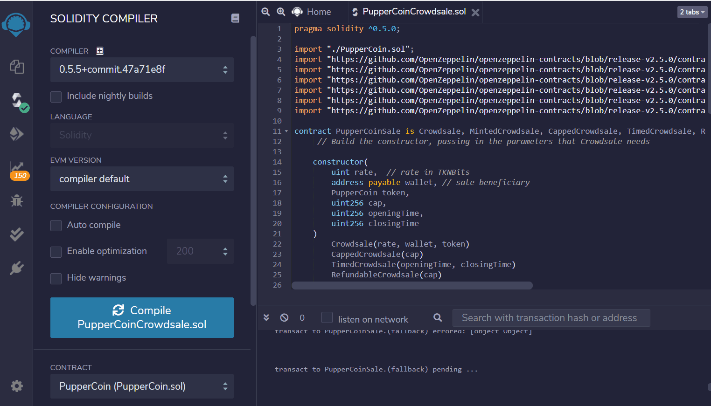
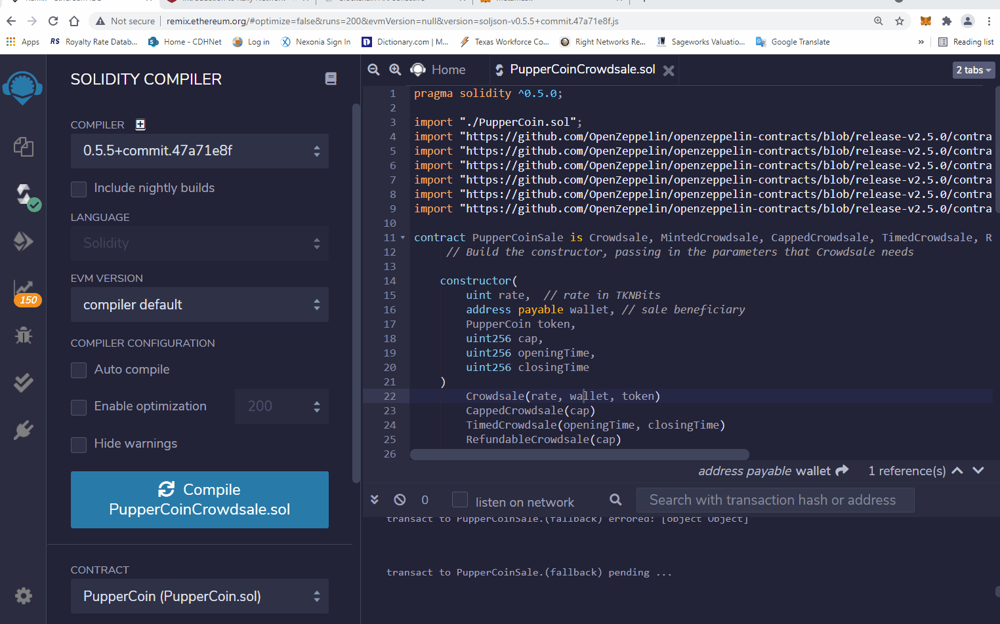
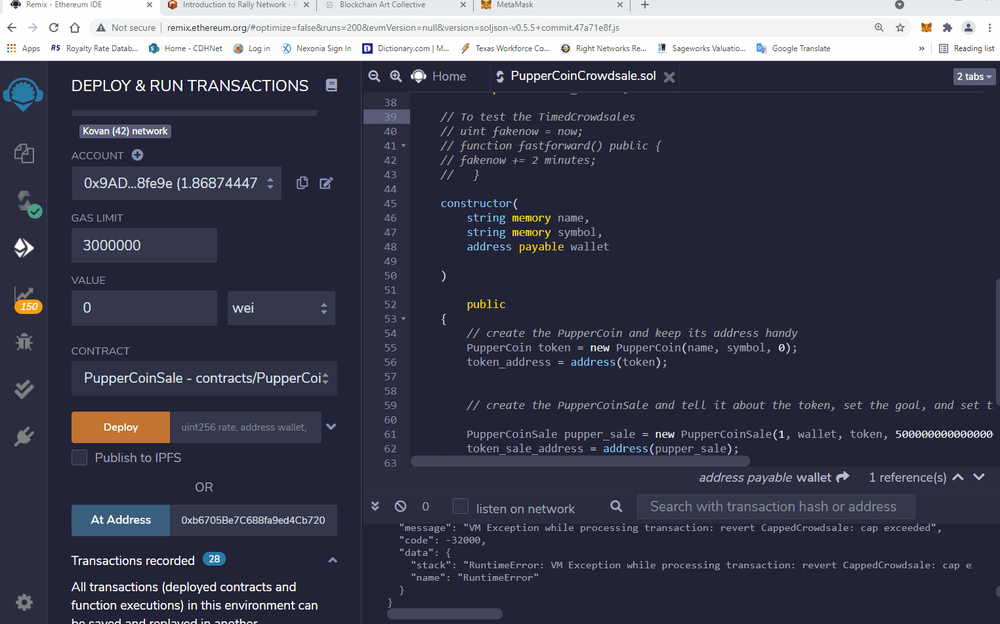
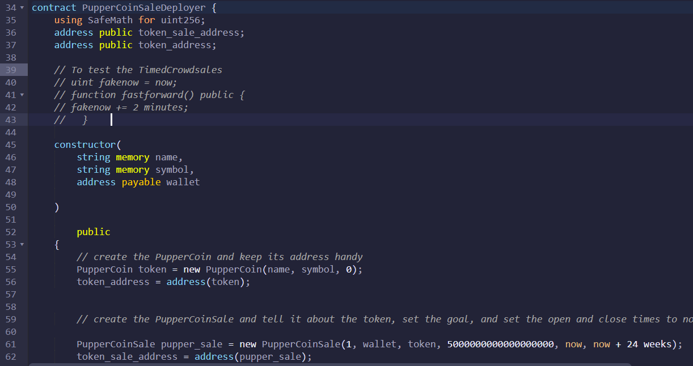
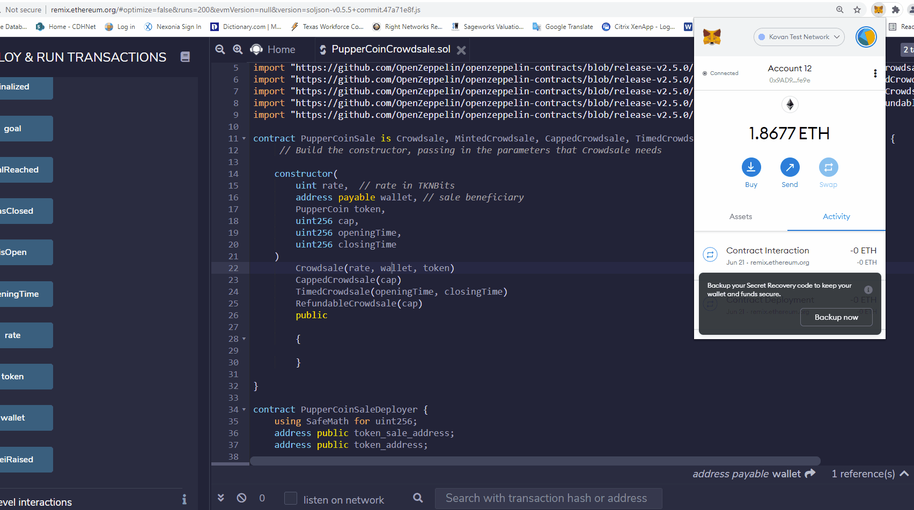

# Pupper Coin Crowdsale
#### Token Name: PupperCoin
#### Token Symbol: PPC
#### There are 2 solidity files, named PupperCoin.sol and PupperCoinCrowdsale.sol
## How to use the contracts
### Step 1: Compile PupperCoin.sol and PupperCoinCrowdsale.sol

### Step 2: Deploy PupperCoinSaleDeployer contract to generates "token_address" and "token_sale_address" under Deployed Contracts
### Verify the right network, account and contract are shown on the left tile. In the Deploy Section, fill out NAME, SYMBOL and WALLET boxes. 
### Copy "Account" address and paste to the WALLET box. Click transact bottun.
### Under Deployed Contracts, "token_address" and "token_sale_address" show up.

### Step 3: Copy "token_address" and paste "At Address" in PupperCoin - Contract/PupperCoin.sol. Then, clock "At Address" button
### Do the same process for "token_sale_address". Paste "At Addresss" in PupperCoinSale - Contract/PupperCoinCrowdSale.sol. THen, click "At Address" button

### Step 4: To buy tokens, fill out the amount to buy in "Value" box. Copy "Account" address of the contract, and paste "buytokens" box under PupperCoinSales. (The "buyTokens" button is in red) Then, click Transact button below. Click confirm on Metamask
 

### To verify the TimedCrowdSale works by using fastforward function. (It is commented out from line 39 to 43) 
### To use that function, change the closingTime from "now + 24 weeks" to "now + XXX minutes or days of your testing period as well. 

### We can check the transaction on Etherscan 

